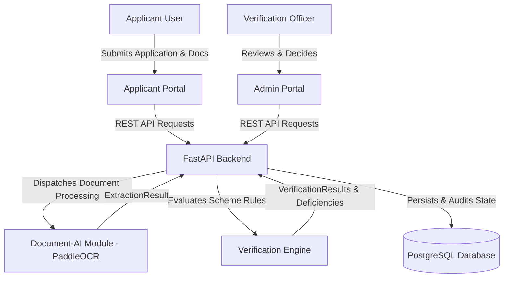
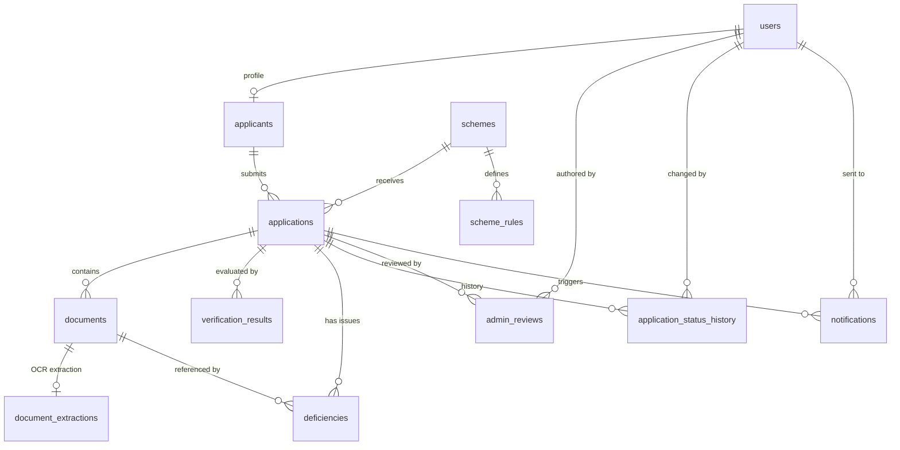

# TribalScholar AI (ADIVYA) — System Architecture

**Project:** TribalScholar AI | Smart India Hackathon 2026  
**Repository:** [priyanshu3016/adivya](https://github.com/priyanshu3016/adivya)  
**Status:** In Progress (Database Layer Complete & Tested)

---

## 1. High-Level Architecture Overview

TribalScholar AI is an intelligent scholarship verification and management platform designed specifically for Scheduled Tribe (ST) applicants across India. The system accelerates the evaluation of scholarship applications from weeks to seconds by combining:
- **PaddleOCR-based Document AI** for automated key-value extraction from certificates and marksheets
- **Deterministic Rule Engine** for scheme compliance and cross-field validation
- **Relational PostgreSQL Database** for transactional integrity, audit logs, and deficiency tracking
- **Role-Based Web Portals** for applicants and scholarship verification officers



---

## 2. Component Boundaries & Responsibilities

| Subsystem | Folder | Lead Role | Description |
|---|---|---|---|
| **Document-AI** | `document-ai/` | Person 2 | Preprocessing, OCR pipeline (PaddleOCR), document classification, and 5 specialized extractors. |
| **Database** | `database/`, `backend/app/db/` | Person 4 | 12-table relational schema, SQLAlchemy 2.0 ORM, Alembic migrations, demo seeds, and CRUD. |
| **Backend API** | `backend/` | Person 3 | FastAPI service, authentication (JWT), file storage, REST endpoints, and orchestration. |
| **Verification Rules** | `verification-rules/` | Person 5 | Eligibility evaluation, fuzzy string cross-matching, and deficiency generator. |
| **Frontend** | `frontend/` | Person 1 | Responsive Applicant submission UI and Admin review dashboard. |

---

## 3. Database Layer Architecture

### 3.1 Technology Stack
- **Database Engine:** PostgreSQL 15+
- **ORM:** SQLAlchemy 2.0 (declarative mapped columns, strict type hints)
- **Driver:** `asyncpg` for high-throughput async FastAPI endpoints; `psycopg2-binary` for Alembic CLI and migration scripts
- **Migration Tooling:** Alembic with versioned migrations (`backend/alembic/versions/`)
- **Native Types:** PostgreSQL `UUID`, `JSONB`, `ARRAY`, `TIMESTAMPTZ`, and `CHECK` constraints

### 3.2 Entity Relationship Model



### 3.3 The Document-AI Integration Contract

The database faithfully mirrors the output dataclass `ExtractionResult` from `document_ai.models`:

```python
# Output of document-ai module
@dataclass
class ExtractionResult:
    document_id: str
    document_type: Optional[str]
    fields: Dict[str, Any]
    extraction_status: str
    errors: List[str]
    ocr_confidence: Optional[float]
```

Stored directly into the `document_extractions` table:
- `extracted_fields`: `JSONB`
- `extraction_status`: `VARCHAR(20)` with check constraint `('success', 'partial', 'manual_review', 'failed')`
- `errors`: `VARCHAR[]` native array
- `ocr_confidence`: `FLOAT` between 0.0 and 1.0

---

## 4. Application Verification Lifecycle

```
[Draft Application]
       │
       ▼
[Applicant Submits (submitted)]
       │
       ▼
[Backend Starts OCR & Checks (under_review)]
       │
   ┌───┴────────────────────────────────┐
   │                                    │
   ▼                                    ▼
[All Checks Pass]              [Deficiencies Found]
   │                                    │
   ▼                                    ▼
(verified)                         (deficient)
   │                                    │
   ▼                                    ▼
[Admin Review]                 [Applicant Rectifies / Officer Inspects]
   │                                    │
   ├──────────────┬─────────────┐       │
   ▼              ▼             ▼       ▼
(approved)    (rejected)   (request_info) ──► Re-upload
```

---

## 5. Security & Privacy Considerations

1. **Aadhaar Protection:** Aadhaar numbers are never stored in plaintext. Only SHA-256 hashes (`aadhaar_number_hash`) are kept for uniqueness checks, preventing identity theft.
2. **Encrypted Passwords:** Passwords are saved as bcrypt hashes (`password_hash`).
3. **Data Immutability:** Audit trail transitions in `application_status_history` are append-only.
4. **Frozen Application Snapshots:** At submission time, the applicant profile is serialized into `applicant_snapshot` (`JSONB`), guaranteeing that later profile modifications do not retroactively alter the submitted legal record.
